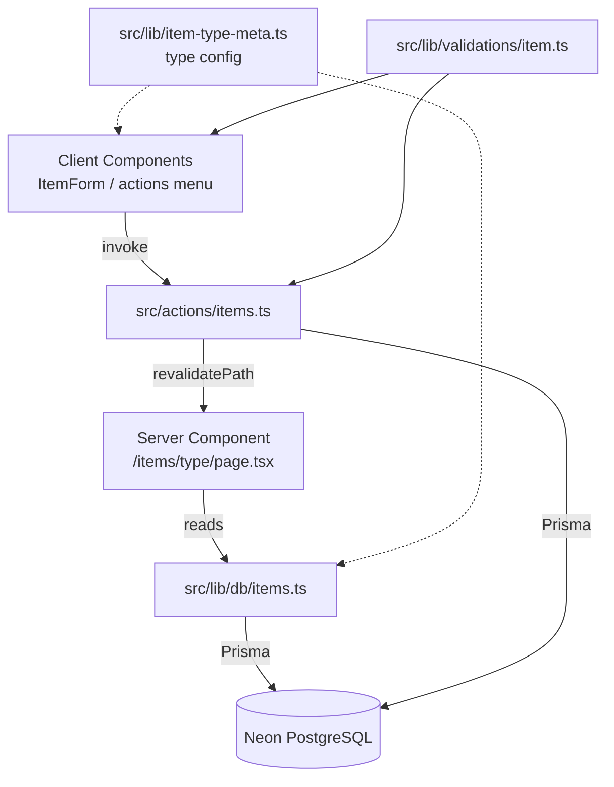
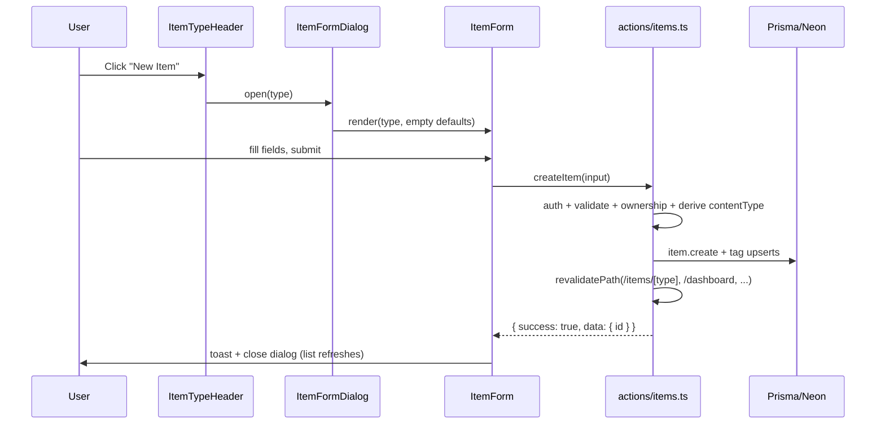

# Item CRUD Architecture

**Last Updated**: 2026-10-02
**Scope**: Design for a unified create / read / update / delete system covering all 7 built-in item types (snippet, prompt, command, note, file, image, url) plus Pro custom types.
**Status**: Proposal — this document describes a target architecture. It does not reflect code that has been written yet.

> **Source note**: two sources named in the research prompt do not exist in the repo.
> - `docs/content-types.md` → the equivalent, current reference is [`docs/item-types.md`](./item-types.md).
> - `src/lib/constants.tsx` → the equivalent is `src/lib/item-type-meta.ts` (icons, colours, canonical order), with the canonical type rows in `prisma/seed.ts`.

---

## 1. Design at a Glance

Four rules drive the whole design:

1. **One mutation surface.** Every create / update / delete for every type lives in a single server-action file, `src/actions/items.ts`.
2. **Queries live in `lib/db` and are called from server components.** `src/lib/db/items.ts` holds all reads; server components call them directly (no API route, no client fetching for initial data).
3. **One dynamic route.** `/items/[type]` is the only item route pattern. It handles all 7 system types and custom types alike. `params.type` is the item type slug/id.
4. **Type-specific behaviour lives in declarative config + components, never in actions.** Actions are generic and storage-oriented; the shared type config and the form/detail components decide what fields to render and how to display each type.



---

## 2. Current State

| Concern | Today |
| --- | --- |
| Schema | `Item` has generic columns: `content`, `url`, `fileUrl`, `fileName`, `fileSize`, `language`, `contentType`, plus shared metadata. No migration needed for CRUD. |
| Type visuals | `src/lib/item-type-meta.ts` — `getTypeVisual`, `SYSTEM_TYPE_ORDER`, `systemTypeOrder`. |
| Reads | `src/lib/db/items.ts` has `getPinnedItems`, `getRecentItems`, `getItemStats`, `getItemTypes`; all scoped to the hardcoded demo user. |
| Writes | None. No `src/actions/items.ts`, no item routes beyond a placeholder list page. |
| `/items/[type]` | Placeholder — renders the type name and count from `src/lib/mock-data.ts`, not the database. |
| Forms | No form library. Existing forms use `useState`/`useRef` + `FormData` + server actions (see `change-password-dialog.tsx`, `delete-account-dialog.tsx`). |
| UI primitives | `button`, `input`, `badge`, `card`, `dialog`, `avatar`, `separator`, `sonner`. Missing: `textarea`, `select`, `label`, `dropdown-menu`, `alert-dialog`. |
| Uploads | None. `file`/`image` columns exist but Cloudflare R2 is not integrated and no SDK is installed. |

**Important**: the dashboard `lib/db` helpers currently scope to `DEMO_USER_EMAIL` because auth was not wired when they were written. Auth is live now, so the CRUD work should thread a `userId` through reads (from `auth()` in the server component) and writes (from `auth()` inside the action). See §11.

---

## 3. Proposed File Structure

```
src/
├─ actions/
│  └─ items.ts                     # "use server" — createItem, updateItem, deleteItem (all types)
├─ lib/
│  ├─ db/
│  │  └─ items.ts                  # all item reads (extend the existing file)
│  ├─ validations/
│  │  └─ item.ts                   # zod schemas + shared result/state types
│  └─ item-type-meta.ts            # existing visuals/order + NEW content-kind & field config
├─ app/
│  └─ (dashboard)/
│     └─ items/
│        └─ [type]/
│           ├─ page.tsx            # server component — list items of one type
│           └─ [id]/
│              └─ page.tsx         # optional server component — detail / view one item
└─ components/
   └─ items/
      ├─ item-type-header.tsx      # (server) type icon, name, count, "New Item" trigger
      ├─ item-list.tsx             # (server) maps items -> ItemRow + empty state
      ├─ item-row.tsx              # row card (promote from components/dashboard)
      ├─ item-actions-menu.tsx     # (client) edit / delete / favorite / pin
      ├─ item-form-dialog.tsx      # (client) dialog shell for create + edit
      ├─ item-form.tsx             # (client) type-adaptive form fields + submit
      ├─ item-detail.tsx           # (server) renders content by content kind
      ├─ item-type-select.tsx      # (client) type picker for the global "New Item" flow
      └─ delete-item-dialog.tsx    # (client) confirm destructive delete
```

### Boundaries

- **`src/actions/items.ts`** — the *only* place item rows are written. No `switch (typeId)`.
- **`src/lib/db/items.ts`** — the *only* place item rows are read. Returns plain, serialisable shapes for server components.
- **`src/lib/item-type-meta.ts`** — the shared, declarative type table (visuals + content kind + field hints). Imported by both components and the validation layer.
- **`src/components/items/*`** — all type-specific rendering and input decisions.
- **`src/app/.../items/[type]/`** — routing only; thin server components that parse params, fetch, and compose.

---

## 4. How `/items/[type]` Routing Works

File: `src/app/(dashboard)/items/[type]/page.tsx`

```ts
export default async function ItemTypePage(props: PageProps<"/items/[type]">) {
  const { type } = await props.params;          // slug: "snippet" | "prompt" | … | custom id
  const session = await auth();
  if (!session?.user?.id) redirect("/sign-in");  // layout also guards this

  const itemType = await getItemType(type, session.user.id);
  if (!itemType) notFound();                     // unknown / not owned -> 404

  const items = await getItemsByType(type, session.user.id);
  // render ItemTypeHeader + ItemList
}
```

Key points:

- **`params.type` is the `ItemType` id.** System ids are stable slugs (`snippet`, `prompt`, `command`, `note`, `file`, `image`, `url`); custom types use their `cuid`. The sidebar already links to `/items/{type.id}`, so no link changes are needed.
- **Resolution is ownership-aware.** `getItemType` looks up either a system type (`isSystem: true, userId: null`) or a custom type owned by the signed-in user. Unknown slugs → `notFound()` (404), not a crash or empty page.
- **No `generateStaticParams`.** Items are per-user and change constantly. The page opts into dynamic rendering with `connection()` (the established pattern in `lib/db`) and resolves the type at request time. The current mock-data-driven `generateStaticParams` is removed.
- **Detail route (optional, same tree).** `/items/[type]/[id]/page.tsx` reuses the same `[type]` segment for breadcrumb/back links and fetches a single item with `getItemById(id, userId)`, then `notFound()` if missing or not owned. This keeps "one dynamic route pattern" (the `[type]` tree) rather than 7 separate trees.
- **`generateMetadata`** derives the page title from the resolved type name (`Snippets · DevStash`).
- **Custom/unknown type visuals** already fall back gracefully in `getTypeVisual`, so a custom type with an unrecognised icon still renders.
- **Unknown type vs empty list** are distinct: an existing type with zero items shows an empty state with a "New Item" CTA.

### Create / edit placement

Creation and editing are **dialogs over the list/detail page**, not extra routes. This matches the existing dialog-based patterns (`ChangePasswordDialog`, `DeleteAccountDialog`) and keeps `/items/[type]` the single route. The global top-bar "New Item" button opens `ItemTypeSelect` first.

*(An alternative — dedicated `/items/[type]/new` and `/items/[type]/[id]/edit` routes — is possible but adds two static route segments per type and duplicates the form shell. Dialogs are recommended.)*

---

## 5. Server Actions — `src/actions/items.ts`

Single file, `"use server"` at the top. Every exported function is an async mutation. Shape follows the established `{ success, data?, error? }` convention from `src/actions/profile.ts`.

```ts
"use server";

// ---- shared result types (also exported from validations/item.ts) ----
export interface ItemMutationState {
  success: boolean;
  data?: { id: string };
  error?: string;
}

// ---- mutations: one per verb, not one per type ----
export async function createItem(input: ItemInput): Promise<ItemMutationState>;
export async function updateItem(input: UpdateItemInput): Promise<ItemMutationState>;
export async function deleteItem(input: { id: string }): Promise<ItemMutationState>;

// ---- optional convenience toggles (same file, same rules) ----
export async function toggleItemFavorite(input: { id: string }): Promise<ItemMutationState>;
export async function toggleItemPinned(input: { id: string }): Promise<ItemMutationState>;
```

### What every mutation does, in order

1. **Authenticate.** `const session = await auth(); if (!session?.user?.id) return { success: false, error: "You must be signed in." }`. The `userId` always comes from the session — never from the client payload.
2. **Validate.** Parse with the relevant zod schema from `src/lib/validations/item.ts`. Return the first issue message on failure.
3. **Authorise the relations.**
   - `typeId` must resolve to a system type **or** a type owned by this user.
   - `collectionId` (if any) must belong to this user.
4. **Derive server-owned fields.** `contentType` (`"text" | "file"`) is computed from the type's content kind, not trusted from the client.
5. **Persist** via `prisma.item.create` / `update` / `delete`. `update`/`delete` scope the `where` by `{ id, userId }` so a user can never touch another user's row (Prisma `update`/`delete` accept a non-unique compound filter in Prisma 7; otherwise verify ownership with a `findFirst` first and return `{ success: false }`).
6. **Sync tags** (create/update): upsert each `Tag` by `@@unique([userId, name])`, then replace `ItemTag` join rows.
7. **Revalidate** affected paths: `` revalidatePath(`/items/${typeId}`) ``, `revalidatePath("/dashboard")`, `revalidatePath("/collections/[id]", "page")` (or the concrete collection paths), and `revalidatePath("/profile")` for counts.
8. **Return** `{ success: true, data: { id } }`.

### Why no per-type branching

The action never inspects `typeId` to decide what to do. It stores into the generic `Item` columns (`content`, `url`, `fileUrl`, `fileName`, `fileSize`, `language`). The only type-aware step is a **data-shape check** driven by the shared config: "text items need `content`, url items need `url`, file items need `fileUrl`." That check is one reusable helper, not seven branches, and it exists because the server must not persist half-empty rows — validation is not presentation.

### Error handling

Wrap Prisma work in `try/catch`, `console.error` the unexpected error, and return a generic `"Something went wrong. Please try again."` — the same convention as `profile.ts`, so internal errors never leak.

---

## 6. Queries — `src/lib/db/items.ts`

Reads stay here and are called directly from server components. The file already exists; extend it and thread `userId` through. Each function calls `await connection()` so the route is request-time dynamic.

| Function | Purpose | Used by |
| --- | --- | --- |
| `getItemTypes(userId)` | System types + the user's counts, canonical order. *(exists; add userId scoping)* | sidebar, profile |
| `getItemType(typeIdOrSlug, userId)` | Resolve one type (system or owned custom). Returns `null` for 404. | `/items/[type]` page |
| `getItemsByType(typeId, userId)` | Full list of the user's items of one type, including tags. | `/items/[type]` page |
| `getItemById(id, userId)` | One item with tags + collection, for the detail view / edit form defaults. | `/items/[type]/[id]` |
| `getPinnedItems(userId)` | Pinned items. *(exists; add userId)* | dashboard |
| `getRecentItems(userId, limit)` | Recently updated. *(exists; add userId)* | dashboard |
| `getItemStats(userId)` | Totals + favorites. *(exists; add userId)* | dashboard |
| `getCollectionsForPicker(userId)` | `{ id, name }[]` for the form's collection dropdown. | `ItemForm` (server-provided props) |

Return shapes are flat and serialisable, e.g. `ItemSummary` (already defined) and:

```ts
export interface ItemDetail extends ItemSummary {
  content: string | null;
  url: string | null;
  language: string | null;
  fileUrl: string | null;
  fileName: string | null;
  fileSize: number | null;
  collectionId: string | null;
}
```

**No mutation logic in this file** and **no query logic in the action file.** The action may re-read a row after writing only if needed to return fresh data, but the UI gets updates via `revalidatePath`.

---

## 7. Validation — `src/lib/validations/item.ts`

Mirrors the `src/lib/validations/password.ts` convention: framework-free, framework-importable, single place for the rules.

```ts
export const itemInputSchema = z.object({
  typeId: z.string().min(1, "Item type is required"),
  title: z.string().trim().min(1, "Title is required").max(200),
  description: z.string().trim().max(1000).optional(),
  content: z.string().optional(),
  url: z.url("Enter a valid URL").optional().or(z.literal("")),
  language: z.string().trim().max(50).optional(),
  collectionId: z.string().nullable().optional(),
  tags: z.array(z.string().trim().min(1)).max(20).optional(),
  isFavorite: z.boolean().optional(),
  isPinned: z.boolean().optional(),
});

export const updateItemSchema = itemInputSchema.partial().extend({
  id: z.string().min(1),
});
```

A small `validateForContentKind(kind, data)` helper (driven by the shared type config) enforces per-kind required fields after the base parse. This is the only place the "which field matters for which kind" rule is expressed server-side, and it is shared with the form so client and server agree.

---

## 8. Where Type-Specific Logic Lives

This is the heart of the design. **Actions and queries are generic; type-specific knowledge is declarative data, and rendering lives in components.**

### 8.1 Shared type config (declarative, framework-free)

Extend `src/lib/item-type-meta.ts` with a content-kind descriptor per system type. This is the single source used by the form, the detail renderer, and the server's shape check.

```ts
export type ContentKind = "text" | "file" | "url";

export interface ItemTypeConfig {
  /** Which payload column(s) this type uses. */
  contentKind: ContentKind;
  /** Whether the text editor should offer a language selector + code styling. */
  codeLike: boolean;
  /** Placeholder/label hints for the form. */
  contentLabel: string;
  contentPlaceholder: string;
  /** File picker hints (file/image only). */
  accept?: string;
}

export const ITEM_TYPE_CONFIG: Record<string, ItemTypeConfig> = {
  snippet: { contentKind: "text", codeLike: true,  contentLabel: "Code",    contentPlaceholder: "Paste code…" },
  prompt:  { contentKind: "text", codeLike: false, contentLabel: "Prompt",  contentPlaceholder: "Write the prompt…" },
  command: { contentKind: "text", codeLike: true,  contentLabel: "Command", contentPlaceholder: "Paste the shell command…" },
  note:    { contentKind: "text", codeLike: false, contentLabel: "Note",   contentPlaceholder: "Write in Markdown…" },
  file:    { contentKind: "file", codeLike: false, contentLabel: "File",   contentPlaceholder: "Upload a file", accept: "*/*" },
  image:   { contentKind: "file", codeLike: false, contentLabel: "Image",  contentPlaceholder: "Upload an image", accept: "image/*" },
  url:     { contentKind: "url",  codeLike: false, contentLabel: "URL",    contentPlaceholder: "https://…" },
};
```

Accessor: `getItemTypeConfig(typeId)` with a safe `text`/generic fallback for custom types (so an unknown custom type still creates a text note).

### 8.2 The rule

| Layer | Owns type-specific logic? |
| --- | --- |
| `src/actions/items.ts` | **No.** Generic persist; one shared shape check. |
| `src/lib/db/items.ts` | **No.** Returns all columns; the renderer decides what to show. |
| `src/lib/item-type-meta.ts` | **Yes — as data.** Icon, colour, order, content kind, field hints. |
| `src/components/items/ItemForm` | **Yes.** Renders the correct editor from `contentKind` / `codeLike`. |
| `src/components/items/ItemDetail` | **Yes.** Renders code, Markdown, link card, image, or file download. |

### 8.3 Per-type presentation matrix

| Type | Content kind | Form editor | Detail renderer |
| --- | --- | --- | --- |
| `snippet` | text | Textarea + language `<Select>` | Syntax-highlighted code block + copy button |
| `prompt` | text | Textarea (no language) | Markdown / preformatted text + copy button |
| `command` | text | Textarea + language `<Select>` | Terminal-style code block + copy button |
| `note` | text | Markdown textarea | Rendered Markdown |
| `file` | file | File picker (R2 upload) | File name/size + download link |
| `image` | file | Image picker + preview | `` preview |
| `url` | url | URL `<Input>` | External link card (favicon + host + title) |
| *custom* | text (fallback) | Plain textarea | Preformatted text |

The form switches only on `contentKind`/`codeLike` — three editor components (`TextContentEditor`, `FileContentEditor`, `UrlContentEditor`) cover all 7 types and any custom type.

---

## 9. Component Responsibilities

| Component | Type | Responsibility | Calls |
| --- | --- | --- | --- |
| `ItemTypeHeader` | server | Type icon/name/count, "New Item" trigger seeded with this type, optional breadcrumb. | — |
| `ItemList` | server | Map items to rows; render empty state with CTA. | — |
| `ItemRow` | server-safe | Icon + type ring, title, pin/fav, description, tags, date. Presentational (promote from `components/dashboard/item-row.tsx`). | — |
| `ItemActionsMenu` | client | Dropdown: Edit, Delete, Toggle favorite, Toggle pinned. Optimistic toggles + toast. | `updateItem`, `deleteItem`, `toggleItemFavorite`, `toggleItemPinned` |
| `ItemFormDialog` | client | Open/close state for create vs edit; owns dialog shell; passes initial values. | wraps `ItemForm` |
| `ItemForm` | client | Type-adaptive fields (`contentKind`), collection picker, tags input, validation display, submit. | `createItem` / `updateItem` |
| `ItemDetail` | server | Render the item by content kind (code/Markdown/link/image/file). | — |
| `ItemTypeSelect` | client | Global "New Item" flow: pick a type, then open `ItemFormDialog` with that type; could enforce the Free/Pro gate. | — |
| `DeleteItemDialog` | client | Destructive confirmation before delete. | `deleteItem` |

### Interaction flow (create)



Edit is the same flow seeded with `ItemDetail` values and `updateItem`; delete uses `DeleteItemDialog` → `deleteItem`. Favorite/pin toggles skip the form and call their actions directly from `ItemActionsMenu`.

---

## 10. Mutation Input Contract

`ItemInput` is a plain serialisable object (server actions can accept these from client components), not `FormData`, so the type-adaptive form can assemble it cleanly:

```ts
export interface ItemInput {
  typeId: string;
  title: string;
  description?: string;
  content?: string;          // text kinds
  url?: string;              // url kind
  language?: string;         // code-like kinds
  collectionId?: string | null;
  tags?: string[];
  isFavorite?: boolean;
  isPinned?: boolean;
  // file kinds — populated after an R2 upload (future)
  fileUrl?: string;
  fileName?: string;
  fileSize?: number;
}
```

`UpdateItemInput = Partial<ItemInput> & { id: string }`.

For `file`/`image`, the upload itself is a separate concern (multipart to an API route or a presigned R2 URL) that yields `fileUrl`/`fileName`/`fileSize`; `createItem` then persists those values. See §12.

---

## 11. Auth Scoping Migration

The existing `lib/db/items.ts` and `lib/db/collections.ts` hardcode `DEMO_USER_EMAIL`. The CRUD work should:

1. Add a `userId: string` parameter to the read helpers and drop `DEMO_USER_EMAIL`.
2. In server components, obtain it once from `auth()` (the `(dashboard)` layout already calls `auth()` and could pass it down, or each page calls `auth()` — the layout pattern is preferred).
3. In actions, always derive `userId` from `auth()` inside the action.

This closes the gap already flagged in the auth security review: dashboard data must not be scoped to a shared demo account once auth is live.

---

## 12. Open Questions / Out of Scope

| Item | Note |
| --- | --- |
| **File/image uploads** | No R2 integration or SDK exists. CRUD can ship for the 5 text/url types first; file/image forms need an upload endpoint (multipart or presigned URL) before `fileUrl`/`fileName`/`fileSize` can be set. |
| **Free vs Pro gating** | The sidebar marks `file` and `image` as Pro (`PRO_TYPE_IDS`), while `project-overview.md` puts "image uploads" on Free. Confirm the rule before enforcing it in `createItem`. Free tier also has a 50-item cap that is not enforced anywhere yet. |
| **Syntax highlighting** | Project spec calls for it, but no highlighter is installed. `ItemDetail` needs a library (e.g. Shiki) or a lightweight highlighter. |
| **Markdown rendering** | Notes claim Markdown, but no renderer is installed. |
| **UI primitives** | Add `textarea`, `select`, `label`, `dropdown-menu`, `alert-dialog` via shadcn. No `react-hook-form` is present; existing forms use `useState` + direct action calls, so `ItemForm` should follow suit to stay consistent (or add the library deliberately). |
| **Tag input UX** | Tags are `ItemTag` joins. Decide between free-text comma input and an autocomplete backed by the user's existing tags. |
| **Search** | Project spec calls for full-text search; not part of this design. |
| **Detail route** | `/items/[type]/[id]` is optional but recommended for deep-linking and a full-screen editor. If dialogs are preferred everywhere, skip it. |
| **Revalidation granularity** | `revalidatePath` is the simplest correct choice; `revalidateTag`/`updateTag` can be layered later. |

---

## 13. Summary of the Contract

- **Mutations** → `src/actions/items.ts` (generic; session-scoped; zod-validated; revalidates).
- **Reads** → `src/lib/db/items.ts` (generic; session-scoped; called from server components).
- **Route** → `src/app/(dashboard)/items/[type]/page.tsx` (single dynamic pattern; `params.type` = type id; `notFound()` on unknown; custom types included).
- **Type-specific logic** → `src/lib/item-type-meta.ts` (declarative config) + `src/components/items/*` (form and detail renderers). Actions never branch on type.
- **Shared config** → one `ITEM_TYPE_CONFIG` table drives both client rendering and the server-side shape check.

## Sources

- `context/project-overview.md` — features, free/pro tiers, tech stack, "full-screen item editor".
- `docs/item-types.md` — the 7 types, fields, storage classification and display status (stand-in for the missing `docs/content-types.md`).
- `prisma/schema.prisma` — `Item`, `ItemType`, `Tag`, `ItemTag`, `Collection`.
- `src/lib/item-type-meta.ts` — current visuals/order (stand-in for the missing `src/lib/constants.tsx`).
- `src/lib/db/items.ts`, `src/lib/db/collections.ts`, `src/lib/db/profile.ts` — read-helper conventions.
- `src/actions/profile.ts`, `src/actions/password-reset.ts`, `src/actions/auth.ts` — server-action, auth, and result-shape conventions.
- `src/lib/validations/password.ts` — validation-module convention.
- `src/app/(dashboard)/layout.tsx`, `src/components/dashboard/{dashboard-shell,sidebar,top-bar,item-row}.tsx` — layout, sidebar links, "New Item" trigger, row component.
- `src/components/profile/{change-password-dialog,delete-account-dialog}.tsx`, `src/components/ui/dialog.tsx` — client form/dialog patterns.
- `context/coding-standards.md`, `context/ai-interaction.md` — file layout, server-component-first, server-action conventions.
